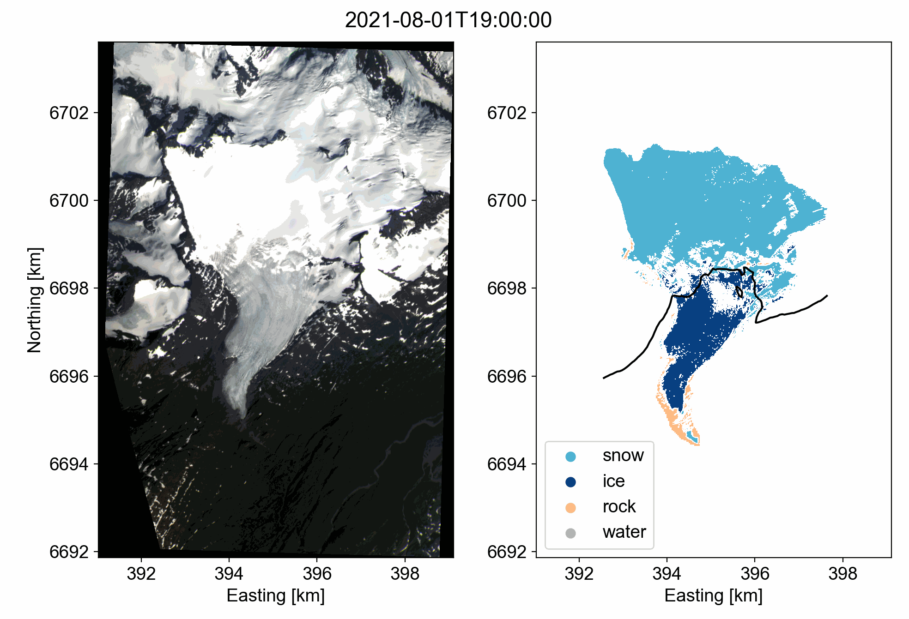

# GEOS 505: Research Computing in the Earth and Environmental Sciences (Fall 2022)

## Rainey Aberle

Email: [raineyaberle@u.boisestate.edu](mailto:raineyaberle@u.boisestate.edu)

### ❄ Research Overview ❄️
Currently, I am working on using Landsat, Sentinel-2, MODIS, and PlanetScope imagery to classify snow-covered area on glaciers using a supervised classification algorithm. I hope to use this method to detect changes in snow line elevations on glaciers over time, which is an important indicator in glacier mass balance applications (in other words, it helps us estimate how much mass the glacier is gaining each year). Here is an example of a classified PlanetScope image at Wolverine Glacier on the Kenai Peninsula in Alaska, with an estimated snowline represented by the black line: 

This course will help me with specific skills related to my research, including:
- Load, sample, and analyze stacks of image bands efficiently. 
- Create clear and appealing data visualizations and figures of results (improve _science communication_ skills). 
- Develop Jupyter Notebooks and code repositories that are easy for others to follow (improve _reproducibility_ of my workflows).
 
### ⭐️ Personal SMART Goals for the semester ⭐️
1. Be able to efficiently load, create, and manipulate spatiotemporal datasets using the `xarray` package, including data visualization tools. 
2. Learn about and use _five_ new climate datasets available for Idaho. 
3. Develop skills in best practices and learn about effective strategies for programming _sprints_ with other team members. 

| SMART | Goals |
|---|---|
| S | Specific | 
| M | Measureable |
| A | Achievable | 
| R | Relevant | 
| T | Time-bound | 

